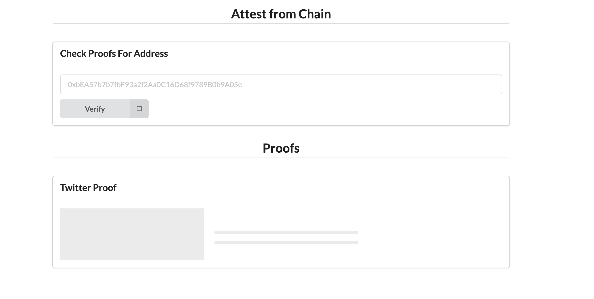
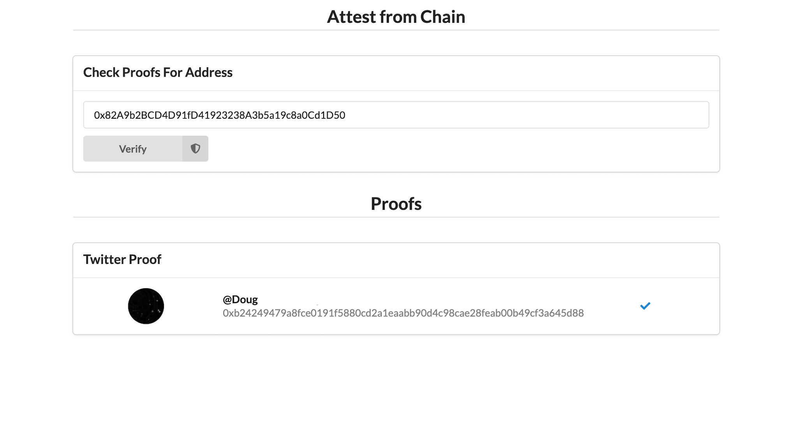

# Attest On-Chain Verification Web2 Frontend

This is the frontend to call a midpoint contract that checks if a user is verified. 





## Getting Started

First, run the development server:

```bash
npm run dev
# or
yarn dev
```

Open [http://localhost:3000](http://localhost:3000) with your browser to see the result.

This project is expecting to interface with our hosted api service whose repo can be found [here](https://github.com/srustagi/ethsf22_identity_provider_backend). It is not currently hosted unless we are demoing. 

## Note
This is a companion web app to demonstrate the ability to verify someone on chain. We use midpoint to show this on web2. The main app can found [here](https://github.com/srustagi/ethsf22_identity_provider_frontend) where you can verify your own profile. 